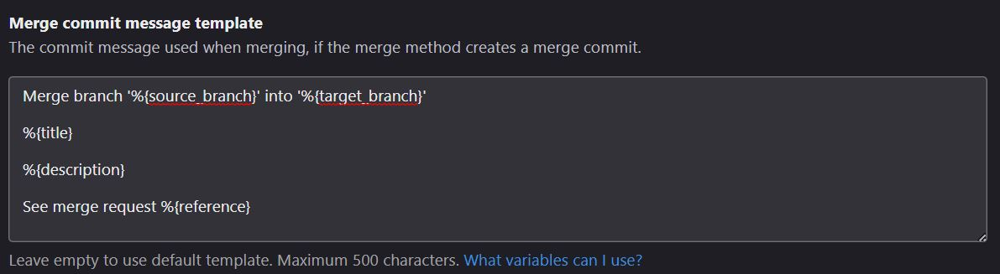
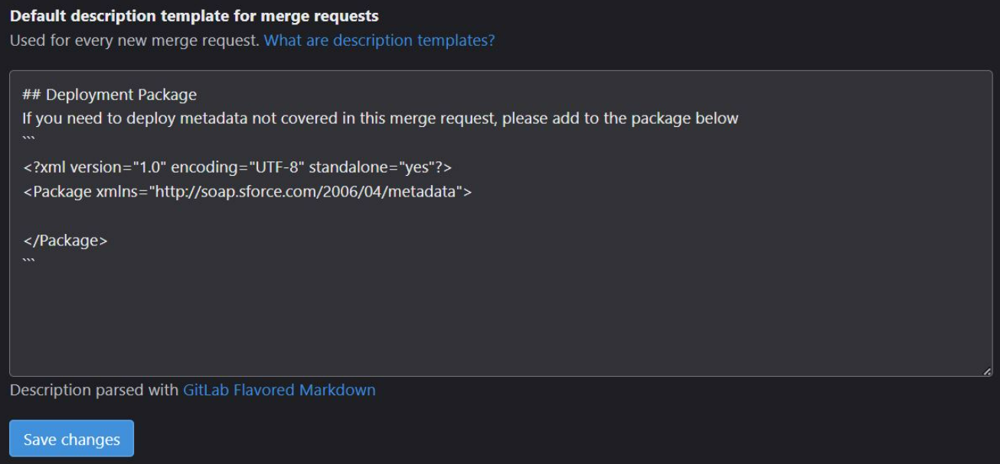

# Salesforce Org Model for GitLab CI/CD using the Salesforce CLI (`sf`)
This repository demonstrates how to use GitLab actions, the Salesforce CLI, the SFDX git delta plugin, and custom Python scripts to validate, deploy, or destroy metadata in a Salesforce org following the org development model, without using packages/scratch orgs. 

Each Salesforce org has its own long-running Git branch.

## CI/CD Jobs

The pipeline is divided into the following stages:

- The `backfill` stage pushes commits from `main` branch backwards to `fqa` and `dev` branches. This is required for branching strategies where developers create branches from `main`, but have to merge their branches into other long running branches (`dev` and `fqa` in this template).
    - This job requires a project access token configured for the GitLab repository - https://docs.gitlab.com/ee/user/project/settings/project_access_tokens.html
    - Add 3 CI/CD variables to the repo called `BOT_NAME`, `BOT_USER_NAME` and `PROJECT_TOKEN`. The `BOT_NAME` should be the name of the project access token/bot account. The `BOT_USER_NAME` will be the user name for the bot account created when making the project access token (ex: `project_{project_id}_bot_{random_string}`). The `PROJECT_TOKEN` will be the passphrase generated after making the token.
    - The Docker image requires a version of Git which can skip pipelines during a push (`git push -o ci.skip`).
- The `validate` stage contains jobs for each org. When a merge request is opened against one of the org branches, it will validate the changes in the org.
    - This has been confirmed on GitLab Merge Request Pipelines (standard pipeline - defaults to this when there are merge conflicts) and Merged Results Pipelines (when there are no conflicts and this setting is enabled in the repo)
    - If you are working on GitLab v16.6, adjust the variable $COMMIT_MSG to use $CI_MERGE_REQUEST_DESCRIPTION to ensure MR pipelines with merge conflicts parse the package in the MR description.
- The `destroy` stage contains jobs for each org that will delete the metadata from the org if the files were deleted from the org branch. This job is allowed to fail and will fail if there are no metadata types detected in the destructive package.
    - This will be a standalone destructive deployment that will run before the deployment by default. If you need to deploy the destructive changes after the deployment, cancel the `destroy` stage when the pipeline is created, allow the `deploy` stage to complete, then re-run the `destroy` stage.
- The `deploy` stage contains jobs for each org that will deploy the metadata to the assigned org after a merge into the org branch.

The deployment and validation status is posted to a Slack channel. Update the webhook variable in the `.gitlab-ci.yml`:

``` yaml
  # Update webhook URL here for your slack channel
  SLACK_WEBHOOK_URL: https://hooks.slack.com/services/
```

## Declare Metadata to Deploy

This org model uses a manifest file (package.xml) to run delta deployments. By default, the SFDX git delta plugin will create a package.xml by comparing the changes between the current commit and previous commit.

As a backup, the GitLab Merge Request description will be parsed via the merge commit message to look for package.xml contents.

The package.xml contents in the Merge Request should be used to declare any metadata that would not be covered by the diff between the current commit and the previous commit.

The following updates must be made to your GitLab repository:
- The default merge commit message should be updated to include the description of the MR for UI merges.

- The default merge request description template should be updated to include the package.xml header and footer.

- Enable Merged Results Pipelines 


The plugin manifest file and the manual manifest file will be merged to create the final deployment package.

The final deployment package cannot contain wildcard characters for delta deployments. If a metadata type contains a wildcard, it will not be added to the final deployment package.

## Declare Apex Tests

To declare specified Apex tests to run when deploying Apex, you must add test annotations to each Apex class file (`*.cls`) and Apex trigger file (`*.trigger`) following the below regular expressions:

- Using `@Test:` regular expression on a single line (multiple tests can be separated by commas or spaces)
```
/**
 * @description       : Class used when running sandbox refreshes
 * @author            : Matt Carvin
 * @Tests: PrepareMySandboxTest TestB
**/
```

- Using `@TestSuites:` regular expression on a single line (multiple tests can be separated by commas or spaces)

```
/**
 * @description       : Class used when running sandbox refreshes
 * @author            : Matt Carvin
 * @TestSuites: PrepareMySandboxTest TestB
**/
```

- Using either regular expression over multiple lines for multiple tests:
```
/**
 * @description       : Class used when running sandbox refreshes
 * @author            : Matt Carvin
 * @TestSuites: PrepareMySandboxTest
 * @TestSuites: TestB
**/
```

The Apex classes and triggers will only be scanned for test annotations if the package.xml contains apex classes or triggers.

## Branch Protection

### Validation Merge Request Pipelines

In the "Merge requests" settings, enable "Pipelines must succeed" to ensure the merge request validation passes before the request can be accepted.

### Code Owners

Update the `CODEOWNERS` file in this repo to define the owners of your code base. Enforce `CODEOWNERS` approval in merge requests to prevent a merge request from being accepted wtihout code owner approval.

## Other CI/CD Platforms

The Python scripts can be used on other CI/CD platforms as-is. Reference the arguments passed to the Python scripts in the sample `.gitlab-ci.yml`.

The only Python script which requires a modifiction is `deploy_slack_status.py`. The job status string should be updated to match your platform:

``` python
    # GitLab's CI_JOB_STATUS will be set to "success" for a successful job
    # Update for other CI environments
    if status == "success":
        slack_msg_header = f":heavy_green_checkmark: *{pipeline_description} succeeded*"
    else:
        slack_msg_header = f":x: *{pipeline_description} failed*"
```

## Bot Deployments

To deploy Einstein Bots, you should update the `.forceignore` file with bot versions to not deploy/retrieve (such as the active bot version) and you should also update the `scripts/replacementFiles` with the Bot User for each org, if you are configuring the bot user. The metadata string replacements are done automatically by the Salesforce CLI before deployment and they are dependent on the `AUTH_ALIAS` variables configure in the `.gitlab-ci.yml`.

If you do not want to use this feature, remove the `replacements` key in the `sfdx-project.json`.

## Connected Apps

The package parsing script will look for `ConnectedApp` in the package.xml and process each connected app in the package.

The script will automatically remove the `<consumerKey>` line in every connected app file as consumer keys are unique in each org and will fail a deployment if left in the file.

When ran in the pipeline, the changes will be discarded when the pipeline completes, so you may consumer keys staged in your repo.