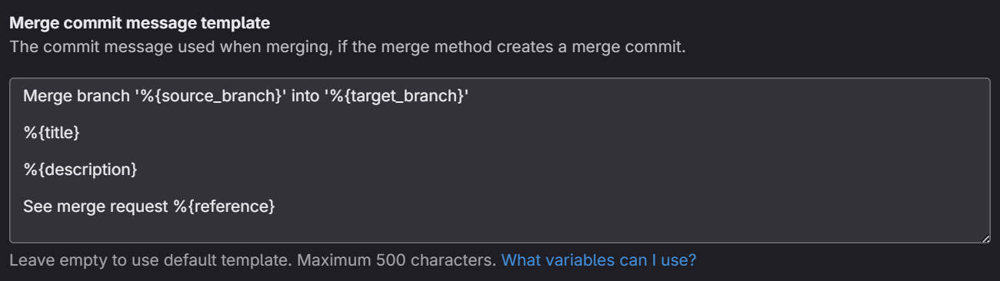

# ava-sf-devops

This repository demonstrates how to use GitLab actions, the Salesforce CLI (`sf`), Salesforce CLI plugins, and bash scripts to validate, deploy, or destroy metadata in a Salesforce org following the org development model, without using packages/scratch orgs.

The model uses these Salesforce CLI plugins:
1. [sfdx-git-delta](https://github.com/scolladon/sfdx-git-delta)
2. [apex-tests-list](https://github.com/renatoliveira/apex-test-list)
3. [apex-code-coverage-transformer](https://github.com/mcarvin8/apex-code-coverage-transformer)
4. [sf-package-combiner](https://github.com/mcarvin8/sf-package-combiner)

## CI/CD Model

The CI/CD model in `.gitlab-ci.yml` follows the org branching model, where each Salesforce org has its own long-running Git branch. The rules in each org job can be customized based on your branching strategy (i.e. target sandbox orgs when a merge request is opened against the `main` branch and target production org when a merge request is accepted into the `main` branch or target all orgs via 1 branch).

## Pipeline Stages

### 1. Pipeline Stage (Optional Ad-Hoc Jobs)
These are optional ad-hoc jobs that can be removed if not needed.
   - **Rollback**: Roll back previous deployments via a web-based pipeline.
   - **ProdBackfill**: Used to refresh long-running branches with changes from `main` when merging into other long-running branches.

These jobs require a GitLab project access token to perform git operations. The token should have a "Maintainer" role with "api" and "write_repository" scope enabled.

These CI/CD variables should be configured in the repo with the token attributes:

- `PAT_NAME` should be the name of the project access token user
- `PAT_USER_NAME` should be the user name of the project access token user
- `PAT_VALUE` should contain the project access token value

### 2. Test Stage
This stage ensures that metadata changes are properly validated and tested.
   - **Validation**: When a merge request (MR) is opened, it will validate the metadata changes in the target org. Each org has its own validate job.
   - **Unit Testing**: A [scheduled pipeline](https://docs.gitlab.com/ci/pipelines/schedules/) with `$JOB_NAME` set to "unitTest" runs all local tests in the target org.
     - Requires `$AUTH_URL` and `$AUTH_ALIAS` variables.
   - **Code Coverage**: The `apex-code-coverage-transformer` creates JaCoCo-formatted reports, which can be visualized in GitLab v17.

### 3. Quality Stage
This stage runs SonarQube scans (if applicable) after all test jobs.
   - Relies on JaCoCo coverage reports created by `apex-code-coverage-transformer` in the test jobs.
   - Can be modified or removed if SonarQube is not used.

### 4. Destroy Stage
Handles the deletion of metadata from the Salesforce org when files are deleted from the branch.
   - Each org has its own destroy job.
   - Jobs are allowed to fail if no metadata types are detected.
   - Destructive deployments are run before constructive deployments by default.
   - If destructive changes need to be deployed after constructive ones, cancel the `destroy` stage, allow `deploy` to complete, then re-run `destroy`.

### 5. Deploy Stage
Deploys constructive metadata changes to the target org. Each org has its own deploy job.

## Declare Metadata to Deploy

This model uses a manifest file (`package.xml`) to run incremental deployments. The `sfdx-git-delta` plugin generates the package based on git diffs.

### Validations and Deployment Packages

Additional metadata can be declared in merge request descriptions or commit messages using the following **package list** format. The opening and closing `<Package>` tags must be included.

```
<Package>
MetadataType: Member1, Member2, Member3
MetadataType2: Member1, Member2, Member3
Version: 60.0
</Package>
```

> `scripts/bash/convert_package_to_list.sh {PATH_TO_PACKAGE}` can be used to convert an existing package.xml, such as one created in Workbench, into the accepted list format.

This is combined with the `sfdx-git-delta` package using the `sf-package-combiner` plugin.

By default, the `<version>` is intentionally omitted from the combined package to default to other source API version inputs. To add `<version>` to the combined package, include `Version: 60.0` (substituting the version number) on a newline in the package list you include in the MR description/commit message.

**Repo Recommendations**
- Update your GitLab repo settings to provide the manadatory package list tags in the default merge request description.


- Update your GitLab repo settings to include the MR description automatically in the merge commit message. 



### Destructive Packages

The destroy job solely relies on the `sfdx-git-delta` destructive package.

## Declare Apex Tests

Apex tests are required for deployments and destructive changes containing Apex classes/triggers.

### Validation and Deployment Tests

The `apex-tests-list` plugin will determine the specified tests to run when validating and deploying.

- Tests must be [annotated](https://github.com/renatoliveira/apex-test-list) with `@tests:` or `@testsuites:` in Apex classes/triggers.

### Destructive Apex Tests

To destroy Apex in production, you must run Apex tests in the destructive deployment. Set the `DESTRUCTIVE_TESTS` variable in `.gitlab-ci.yml` with the pre-defined tests to run when destroying Apex in production.

> **Sandbox orgs do not require destructive tests.**

## Connected Apps
If connected apps are detected in a package, their `<consumerKey>` line is automatically removed before deployment to avoid failures.

## Slack Integration
Deployment, test, and destruction statuses can be posted to a Slack channel.
Update the webhook URL in `.gitlab-ci.yml`:
```yaml
SLACK_WEBHOOK_URL: https://hooks.slack.com/services/
```
To disable Slack notifications, remove this variable, the `scripts/bash/deploy_slack_status.sh` step, and the `scripts/bash/post_test_result.sh` step.

## Branch Protection
### Validation Merge Request Pipelines
Enable "Pipelines must succeed" in GitLab's Merge Request settings to enforce validation before merging.

### Protected CI/CD Environments
Protect environments to restrict who can deploy changes. Validation environments (`validate-*`) can be left open, while destructive and deploy environments should be restricted.

## Bot Deployments
For Einstein Bots, update:
- `.forceignore` to exclude bot versions not to deploy.
- `scripts/replacementFiles` to configure the Bot User per org.
- `sfdx-project.json` to run the right `replacements` per environment variables

> If not using this feature, remove `replacements` from `sfdx-project.json`.

## Other CI/CD Platforms

Bash scripts in `scripts/bash` can be adapted for other CI/CD platforms if environment variables are configured as such to align with GitLab pre-defined variables or custom ones.

### Pre-defined GitLab CI/CD variables
- `$CI_PIPELINE_SOURCE` = should be "push" to deploy and some other value to validate
- `$CI_ENVIRONMENT_NAME` = Salesforce org name (scripts assume "prd" is production)
- `$CI_JOB_STAGE` = `test`, `destroy`, or `deploy`
- `$CI_JOB_STATUS` = `success` or `failure` (Slack post only)
- `$GITLAB_USER_NAME` = user name who triggered pipeline (Slack post only)
- `$CI_JOB_URL` = URL for the CI/CD job log (Slack post only)
- `$CI_PROJECT_URL` = base URL for source control repo (Slack post only)

### Custom CI/CD variables
- `$DEPLOY_PACKAGE` = path to `package.xml` to deploy/validate
- `$DEPLOY_TIMEOUT` = Salesforce CLI wait time in seconds for retrievals and deployments
- `$DESTRUCTIVE_CHANGES_PACKAGE` = path to `destructiveChanges.xml`
- `$DESTRUCTIVE_PACKAGE` = path to `package.xml` required for destructive deployments (same folder as `destructiveChanges.xml`)
- `$DESTRUCTIVE_TESTS` = pre-defined Apex tests to run when destroying Apex in production (separate multiple tests by a single space)
- `$COMMIT_MSG` = commit message containing package list format
    - Uses GitLab pre-defined variables depending on if validation or deployment
- `$BEFORE_SHA` = `--from` SHA to use with `sfdx-git-delta`
    - Uses 2 pre-defined GitLab CI/CD variables depending on if validation or deployment
- `$AUTH_ALIAS` = each org needs a unique authorization alias
- `$AUTH_URL` = each org needs a unique SFDX Force Auth URL
- `$SLACK_WEBHOOK_URL` = webhook for Slack integration