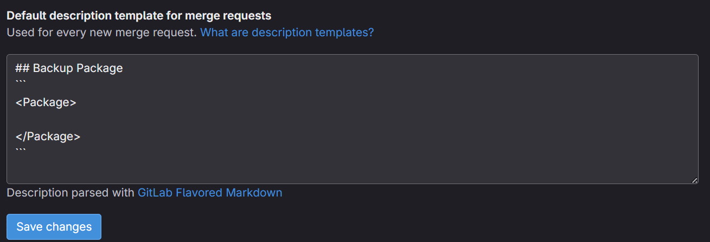
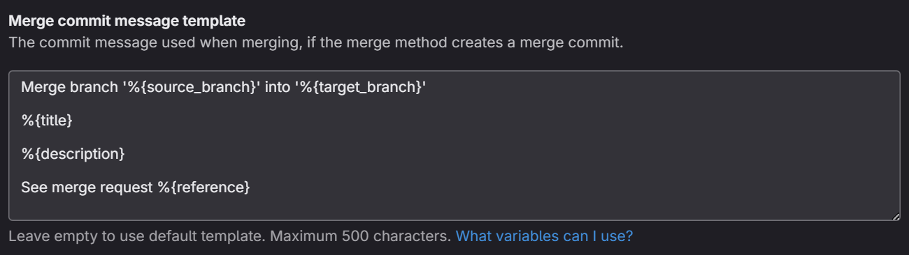

# Salesforce DX Project Template

A batteries-included **Salesforce DX (SFDX) project template** for teams running the **org development model** (long-running branches per org, no scratch orgs or unlocked packages). It is the result of my work building a custom Salesforce CI/CD model on top of the Salesforce CLI (`sf`), a handful of open-source plugins (several of which I authored), and a set of reusable shell/Python helpers.

Fork or clone this repository as the starting point for a new SFDX project and you get an opinionated, end-to-end CI/CD setup out of the box - GitLab pipelines, incremental deploys, specified Apex test selection, SonarQube quality gates, rollbacks, sandbox refresh automation, Slack notifications, Einstein Bot per-org replacements, and more.

> The pipeline lives under `.gitlab/workflows/` and is wired up in `.gitlab-ci.yml`. The bash, Python, and config that power it all live under `scripts/` and at the repo root. Anything Avalara-specific (Grafana annotation includes, internal runner `tags`, branch names like `dev`/`fullqa`) is meant to be customized for your own org.

<!-- TABLE OF CONTENTS -->
<details>
  <summary>Table of Contents</summary>

- [What's in the Template](#whats-in-the-template)
- [Salesforce CLI Plugins](#salesforce-cli-plugins)
- [Getting Started](#getting-started)
- [CI/CD Model](#cicd-model)
- [Pipeline Stages](#pipeline-stages)
  - [Build Stage](#build-stage)
  - [Maintenance Stage (Optional Ad-Hoc Jobs)](#maintenance-stage-optional-ad-hoc-jobs)
  - [Test Stage](#test-stage)
  - [Quality Stage](#quality-stage)
  - [Merge Stage](#merge-stage)
  - [Destroy Stage](#destroy-stage)
  - [Deploy Stage](#deploy-stage)
- [Declare Metadata to Deploy](#declare-metadata-to-deploy)
  - [Validations and Deployment Packages](#validations-and-deployment-packages)
  - [Destructive Packages](#destructive-packages)
- [Declare Specified Apex Tests](#declare-specified-apex-tests)
  - [Validation and Deployment Apex Tests](#validation-and-deployment-apex-tests)
  - [Destructive Apex Tests](#destructive-apex-tests)
- [Connected Apps](#connected-apps)
- [Einstein Bots](#einstein-bots)
- [Slack Integration](#slack-integration)
- [Branch Protection](#branch-protection)
- [Adapting to Other CI/CD Platforms](#adapting-to-other-cicd-platforms)
  - [Pre-defined GitLab CI/CD Variables](#pre-defined-gitlab-cicd-variables)
  - [Custom CI/CD Variables](#custom-cicd-variables)

</details>

## What's in the Template

| Area | What you get |
| --- | --- |
| **SFDX project skeleton** | `sfdx-project.json`, `force-app/`, `config/`, `.forceignore`, namespace-ready packaged plugin dependencies |
| **CI/CD pipeline** | Modular GitLab pipeline split across `.gitlab/workflows/` (base templates, core jobs, test/quality, maintenance, and per-org files under `orgs/`) |
| **Deployment scripting** | `scripts/bash/` for incremental deploy, destroy, rollback, auto-merge, sandbox refresh, branch back-merge, Slack status posting, etc. |
| **Python helpers** | `scripts/python/` for manifest/git-delta comparison, Apex test annotation counting, and package validation |
| **Reusable manifests** | Pre-made `package.xml` files in `scripts/packages/` (Apex, Automation, Bots, Objects, Security & Access, UI, etc.) for retrieves and targeted deploys |
| **Static analysis** | PMD rulesets (`scripts/pmd/enforced` + `scripts/pmd/encouraged`) and a SonarQube config (`sonar-project.properties`) |
| **Quality tooling** | ESLint, Prettier (with Apex + XML plugins), Husky pre-commit hooks, lint-staged, Jest (LWC) |
| **Docker** | `Dockerfile` and `.dockerignore` for a pipeline runner image that ships with `sf`, the plugins below, and OS deps |
| **Einstein Bot support** | `sfdx-project.json` `replacements` and `scripts/replacementFiles/` for swapping the bot run-as user per org |

## Salesforce CLI Plugins

The model relies on these Salesforce CLI plugins (I authored items 3-5):

1. [sfdx-git-delta](https://github.com/scolladon/sfdx-git-delta) - generate incremental `package.xml` / `destructiveChanges.xml` from git diffs
2. [apex-tests-list](https://github.com/renatoliveira/apex-test-list) - resolve specified Apex tests from annotations
3. [apex-code-coverage-transformer](https://github.com/mcarvin8/apex-code-coverage-transformer) - convert Salesforce coverage JSON to JaCoCo / Cobertura / lcov
4. [sf-package-combiner](https://github.com/mcarvin8/sf-package-combiner) - merge multiple `package.xml` files
5. [sf-package-list](https://github.com/mcarvin8/sf-package-list) - declare metadata in a compact list format and convert to `package.xml`

All five are pre-installed in the `Dockerfile`.

## Getting Started

1. **Use this repo as a template** (GitLab fork / GitHub "Use this template" / `git clone`) and push it to your own remote.
2. **Update SFDX project metadata** in `sfdx-project.json` - clear the example `plugins.dependencies` namespaces and the `replacements` blocks if you don't need them.
3. **Configure your orgs** under `.gitlab/workflows/orgs/`. See [`.gitlab/workflows/orgs/README.md`](.gitlab/workflows/orgs/README.md) for a step-by-step guide to adding, renaming, or removing org files. The template ships with `dev.yml`, `fullqa.yml`, and `production.yml` as examples.
4. **Set CI/CD variables** in your GitLab project (see [Custom CI/CD Variables](#custom-cicd-variables)). Each org needs its own `*_AUTH_URL` secret containing an `sf org login sfdx-url` value.
5. **Pick a runner image**. The default is `$CI_REGISTRY_IMAGE:production`, built from the included `Dockerfile`. Build/push that image, or swap in your own image that has `sf` and the [plugins](#salesforce-cli-plugins) installed.
6. **Remove what you don't need.** The `include:` block in `.gitlab-ci.yml` pulls in an internal Grafana deployment-annotation template - drop it if you aren't using Grafana. Likewise, remove the SonarQube job, Slack hook, or maintenance jobs you don't want.
7. **Push and open a merge request** against an org branch (e.g. `develop`) to see the validate pipeline run.

## CI/CD Model

The pipeline in `.gitlab-ci.yml` follows the **org branching model**: each Salesforce org has its own long-running git branch (e.g. `develop` -> Dev sandbox, `fullqa` -> Full QA, `main` -> Production). Merge requests targeting an org branch trigger validate jobs against that org; merging into the branch triggers a real deploy.

Per-org rules are isolated to one YAML file per org under `.gitlab/workflows/orgs/`, so you can customize a branching strategy (one branch per org, MR-to-`main` validates everything, fan-out to multiple orgs, etc.) without touching the shared job templates.

## Pipeline Stages

The pipeline declares these stages in order:

```
build -> maintenance -> test -> quality -> merge -> destroy -> deploy
```

### Build Stage

Reserved for pre-flight steps (image checks, dependency installs, package-list validation, etc.). Add jobs here if your project needs an explicit build before validate/deploy.

### Maintenance Stage (Optional Ad-Hoc Jobs)

`.gitlab/workflows/maintenance-pipeline.yml` defines opt-in jobs that run only via web-triggered pipelines:

- **rollback** - roll back a previous deployment using a `$SHA` variable.
- **releaseBranch** - cut a release branch from a tag pattern (`rb_v*`) using a curated set of story branches.
- **sandboxRefresh** - create or refresh a sandbox via the SF CLI, gated by a tag pattern (`sandbox_v*`).
- **back-merge from production to sandbox branches** - keep long-running org branches refreshed with changes from `main` without re-triggering CI.

The jobs that perform git operations require a GitLab project access token with the `Maintainer` role and `api` + `write_repository` scopes. Provide it through these variables:

- `PAT_NAME` - display name of the token user
- `PAT_USER_NAME` - username of the token user
- `PAT_VALUE` - the token value itself

Remove any of these jobs you don't need.

### Test Stage

Validates and tests metadata changes before they merge.

- **Validate** - on a merge request, validates the metadata delta against the target org. One validate job per org (in `.gitlab/workflows/orgs/<org>.yml`).
- **Unit Test** - a [scheduled pipeline](https://docs.gitlab.com/ci/pipelines/schedules/) with `$JOB_NAME=unitTest` runs all local Apex tests in the target org. Requires `$AUTH_URL` and `$AUTH_ALIAS`.
- **Code Coverage** - `apex-code-coverage-transformer` produces JaCoCo reports rendered natively in GitLab 17+ MR diffs.

### Quality Stage

Runs SonarQube after the test jobs and consumes the JaCoCo coverage from `apex-code-coverage-transformer`. Configured via `sonar-project.properties`. Delete the job if you don't run Sonar.

### Merge Stage

If a merge request has conflicts, this stage completes the merge using the project access token and auto-resolves by accepting source-branch changes. It is the last job in an MR pipeline and can be triggered without test/quality passing.

Requires the same `PAT_*` variables described under [Maintenance](#maintenance-stage-optional-ad-hoc-jobs).

> If you enforce rebase-before-merge or want a different conflict-resolution strategy, drop this stage. It exists as an escape hatch for conflict-prone repositories.

### Destroy Stage

Removes metadata from the target org. Two flavors are supported:

1. **Push-pipeline destroys** - deleting metadata files on the org branch triggers a destructive deploy generated by `sfdx-git-delta`. One destroy job per org. Allowed to fail when no destructive types are detected. Runs before the constructive deploy by default; cancel `destroy`, let `deploy` finish, then re-run `destroy` if you need the opposite order.
2. **Web-pipeline destroys** - trigger a web pipeline on the org branch with a `$PACKAGE` variable containing metadata in [sf-package-list](https://github.com/mcarvin8/sf-package-list) format. The pipeline converts that into `destructiveChanges.xml` before deploying. Use this for controlled, isolated destructions.

### Deploy Stage

Deploys constructive metadata to the target org once an MR merges to the org branch. One deploy job per org.

## Declare Metadata to Deploy

The model runs **incremental deployments** off a manifest (`manifest/package.xml`) that `sfdx-git-delta` generates from the git diff. You can extend that delta with extra metadata in two ways.

### Validations and Deployment Packages

Additional metadata can be declared in the **merge request description** or **commit message** using the [sf-package-list](https://github.com/mcarvin8/sf-package-list) format. The `<Package>` tags are required:

```
<Package>
MetadataType: Member1, Member2, Member3
MetadataType2: Member1, Member2, Member3
Version: 60.0
</Package>
```

The list is merged into the git-delta package by `sf-package-combiner`. The `<version>` tag is intentionally omitted from the combined package so it falls back to other API-version sources; add `Version: 60.0` to the list to force a specific version.

**Repo recommendations**

- Update the project's default MR description to include the `<Package>` template:

  

- Update the merge commit message template to include the MR description (`%{description}`):

  

### Destructive Packages

Destructive packaging differs by pipeline source.

**Push pipelines** rely solely on the `sfdx-git-delta` destructive package.

**Web pipelines** consume the [sf-package-list](https://github.com/mcarvin8/sf-package-list) format passed via `$PACKAGE`:

```
MetadataType: Member1, Member2, Member3
MetadataType2: Member1, Member2, Member3
```

The pipeline converts the list to `destructiveChanges.xml` before deploying.

## Declare Specified Apex Tests

Apex tests are required when a deployment includes Apex classes or triggers. The model uses **specified tests** rather than running every test in the org.

### Validation and Deployment Apex Tests

The `apex-tests-list` plugin resolves specified tests from annotations.

- Apex classes and triggers must be [annotated](https://github.com/renatoliveira/apex-test-list) with `@tests:` or `@testsuites:` to declare their tests.

### Destructive Apex Tests

Destroying Apex in production requires running Apex tests with the destructive deployment. Set `DESTRUCTIVE_TESTS` in `.gitlab-ci.yml` to a space-separated list of test classes to run.

> Sandboxes do not require destructive tests.

## Connected Apps

When a Connected App is in the deployment package, its `<consumerKey>` line is stripped automatically before deploy to avoid Salesforce errors.

## Einstein Bots

To deploy Einstein Bots with this template:

- update `.forceignore` to exclude bot versions you do not want retrieved or deployed
- edit the files in `scripts/replacementFiles/` to set the running bot user per org
- update the `replacements` block in `sfdx-project.json` so each org gets the right substitution

> Remove the `replacements` block from `sfdx-project.json` if you aren't deploying bots.

## Slack Integration

Deploy, test, and destroy outcomes can be posted to a Slack channel. Set the webhook in `.gitlab-ci.yml`:

```yaml
SLACK_WEBHOOK_URL: https://hooks.slack.com/services/
```

To disable Slack, remove the variable plus the `scripts/bash/deploy_slack_status.sh` and `scripts/bash/post_test_result.sh` steps.

## Branch Protection

- **Validation MR pipelines** - enable "Pipelines must succeed" in GitLab MR settings to block merges until validate passes.
- **Protected CI/CD environments** - protect deploy and destroy environments to restrict who can ship. Leave `validate-*` environments open so any contributor can validate.

## Adapting to Other CI/CD Platforms

The scripts in `scripts/bash/` and `scripts/python/` are not GitLab-specific - they read from environment variables. Wire up the same variables on another platform (GitHub Actions, Bitbucket Pipelines, Jenkins, Azure DevOps, etc.) and the rest of the model carries over. The plugin set and `Dockerfile` are also platform-agnostic.

### Pre-defined GitLab CI/CD Variables

| Variable | Purpose |
| --- | --- |
| `$CI_PIPELINE_SOURCE` | `push` triggers a deploy; anything else validates |
| `$CI_ENVIRONMENT_NAME` | Salesforce org name (scripts treat `prd` as production) |
| `$CI_JOB_STAGE` | `test`, `destroy`, or `deploy` |
| `$CI_JOB_STATUS` | `success` or `failure` (Slack only) |
| `$GITLAB_USER_NAME` | user who triggered the pipeline (Slack only) |
| `$CI_JOB_URL` | URL of the CI job log (Slack only) |
| `$CI_PROJECT_URL` | base URL of the repo (Slack only) |

### Custom CI/CD Variables

| Variable | Purpose |
| --- | --- |
| `$DEPLOY_PACKAGE` | path to the `package.xml` to deploy/validate |
| `$DEPLOY_TIMEOUT` | `sf` wait time (seconds) for deploys/retrieves |
| `$DESTRUCTIVE_CHANGES_PACKAGE` | path to `destructiveChanges.xml` |
| `$DESTRUCTIVE_PACKAGE` | path to the empty `package.xml` paired with `destructiveChanges.xml` |
| `$DESTRUCTIVE_TESTS` | Apex tests to run when destroying Apex in production (space-separated) |
| `$COMMIT_MSG` | commit/MR message containing the package list (sourced from GitLab pre-defined vars depending on validate vs deploy) |
| `$BEFORE_SHA` | `--from` SHA for `sfdx-git-delta` (sourced from different GitLab pre-defined vars for validate vs deploy) |
| `$AUTH_ALIAS` | unique authorization alias per org |
| `$AUTH_URL` | unique SFDX auth URL per org |
| `$SLACK_WEBHOOK_URL` | Slack webhook for status posts |
| `$PAT_NAME` / `$PAT_USER_NAME` / `$PAT_VALUE` | project access token used by merge/maintenance jobs |
